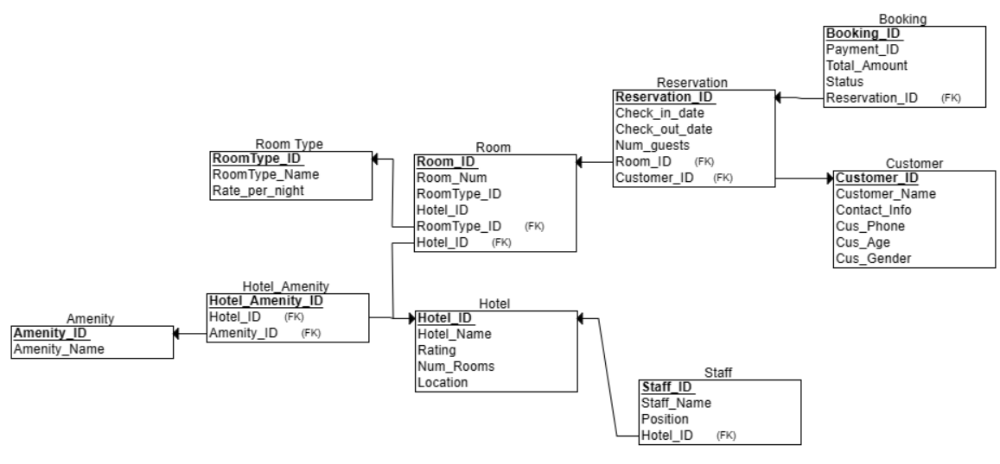
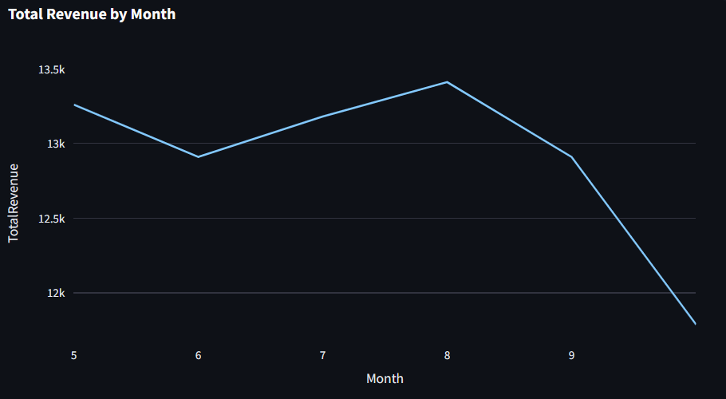
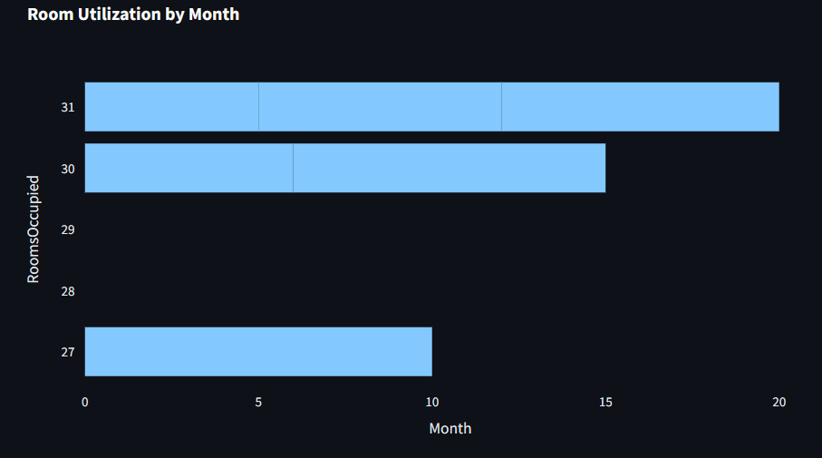
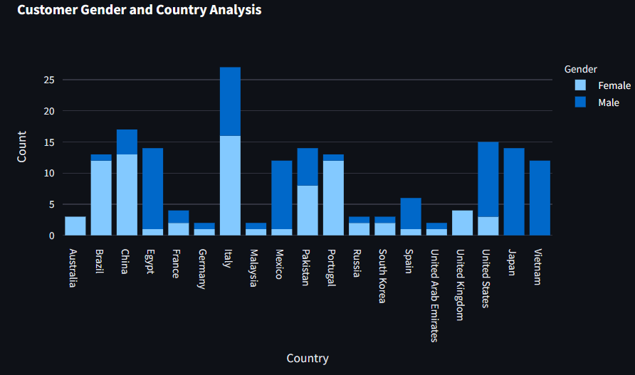
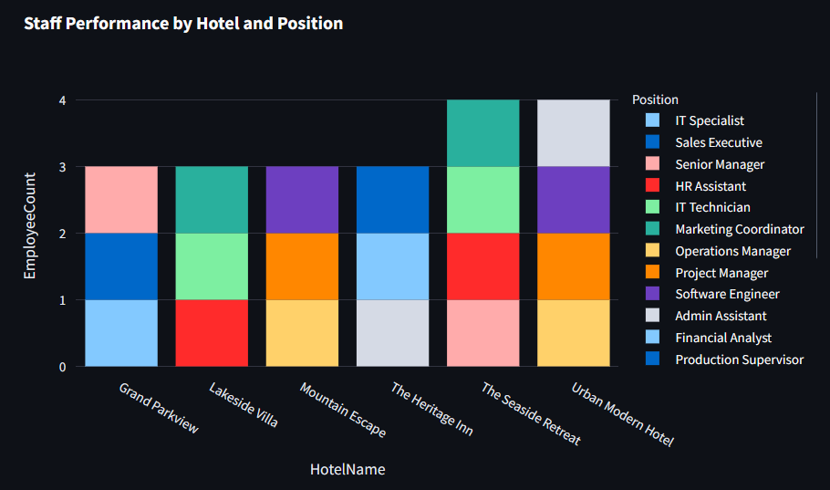

# Hướng Dẫn Chạy Chương Trình

Đây là hướng dẫn cài đặt và chạy chương trình của bạn.

## Bước 1: Clone Repository

```bash
git clone https://github.com/DevPhamPham/Streamlit_Python.git
```

## Bước 2: Cài Đặt Dependencies

```bash
pip install -r requirements.txt
```

## Bước 3: Chạy Ứng Dụng

```bash
streamlit run main.py
```

## Cấu Hình Kết Nối Database

Trước khi chạy ứng dụng, hãy điều chỉnh các thông số kết nối đến cơ sở dữ liệu trong tệp .streamlit/secrets.toml. Đảm bảo rằng bạn đã cung cấp đầy đủ thông tin cho servername, database, username, và password.

</hr>

## Relationship Schema



## Giải Thích Các Dashboard

### Dashboard 1: Tổng Doanh Thu



Query SQL: Truy vấn SQL này tính tổng doanh thu (TotalRevenue) từ bảng Payments dựa trên thời gian check-in (Check_in_Date) từ bảng Reservation, nhóm theo từng tháng và năm.

Chuyển Đổi Dữ Liệu: Dữ liệu từ truy vấn được chuyển từ tuple chuỗi sang tuple số và Decimals để đảm bảo tính chính xác của dữ liệu số.

Tạo DataFrame và Hiển Thị Dữ Liệu: Dữ liệu sau khi chuyển đổi được đưa vào DataFrame của Pandas và hiển thị trong một phần mở rộng để xem dữ liệu chi tiết.

Vẽ Đồ Thị: Sử dụng Plotly Express, đồ thị dạng đường được tạo để biểu diễn tổng doanh thu theo tháng trong một năm. Điều này giúp dễ dàng nhận biết xu hướng tăng giảm của doanh thu theo thời gian.

### Dashboard 2: Số Lượng Phòng Sử Dụng



Query SQL: Đoạn code sử dụng một truy vấn SQL để đếm số lượng phòng đã được sử dụng (RoomsOccupied) trong mỗi tháng của mỗi năm từ bảng Reservation. Truy vấn này nhóm dữ liệu theo thời gian (năm và tháng).

Chuyển Đổi Dữ Liệu: Dữ liệu từ truy vấn được chuyển từ tuple chuỗi sang tuple số và Decimals để đảm bảo tính chính xác của dữ liệu số.

Tạo DataFrame và Hiển Thị Dữ Liệu: Dữ liệu sau khi chuyển đổi được đưa vào DataFrame của Pandas và hiển thị trong một phần mở rộng để xem dữ liệu chi tiết.

Vẽ Đồ Thị: Sử dụng Plotly Express, đồ thị dạng cột (bar chart) được tạo để biểu diễn tình trạng sử dụng phòng theo tháng trong một năm. Điều này giúp dễ dàng nhận biết và so sánh số lượng phòng được sử dụng trong các tháng khác nhau.

### Dashboard 3: Phân Tích Giới Tính và Quốc Gia



Query SQL: Truy vấn SQL này lấy dữ liệu từ bảng Customer và nhóm dữ liệu theo giới tính (Gender) và quốc gia (Country).

Chuyển Đổi Dữ Liệu: Dữ liệu từ truy vấn được chuyển từ tuple chuỗi sang tuple số và chuỗi.

Tạo DataFrame và Hiển Thị Dữ Liệu: Dữ liệu sau khi chuyển đổi được đưa vào DataFrame của Pandas và hiển thị trong một phần mở rộng để xem trước dữ liệu chi tiết.

Vẽ Đồ Thị: Sử dụng Plotly Express, đồ thị cột (bar chart) được tạo để biểu diễn phân tích giới tính và quốc gia của khách hàng.

### Dashboard 4: Hiệu Suất Nhân Viên



Query SQL: Truy vấn SQL này lấy dữ liệu từ bảng Hotels và kết hợp nó với bảng Staff thông qua trường Hotel_ID.

Chuyển Đổi Dữ Liệu: Dữ liệu từ truy vấn được chuyển từ tuple chuỗi sang tuple số và chuỗi.

Tạo DataFrame và Hiển Thị Dữ Liệu: Dữ liệu sau khi chuyển đổi được đưa vào DataFrame của Pandas và hiển thị trong một phần mở rộng để xem trước dữ liệu chi tiết.

Vẽ Đồ Thị: Sử dụng Plotly Express, đồ thị cột (bar chart) được tạo để biểu diễn hiệu suất nhân viên theo từng khách sạn và vị trí công việc. Mỗi cột của đồ thị biểu diễn số lượng nhân viên tại mỗi vị trí công việc, với màu sắc thể hiện vị trí công việc khác nhau. Điều này giúp quản lý dễ dàng nhìn ra sự phân bố của nhân viên tại các vị trí công việc trong từng khách sạn.
